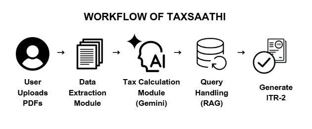
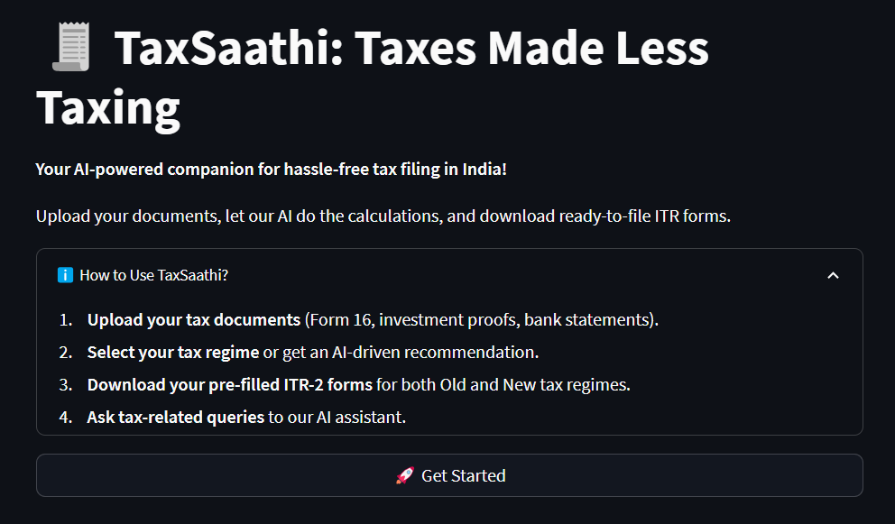
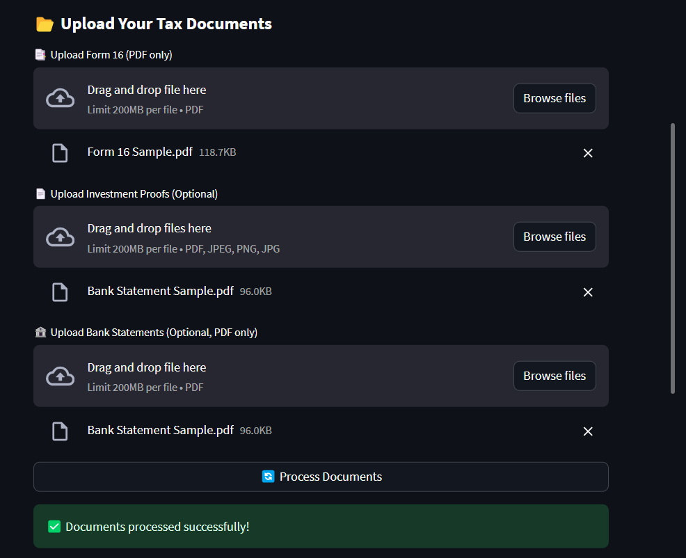
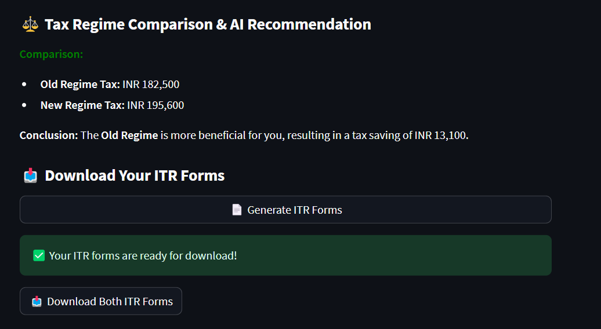
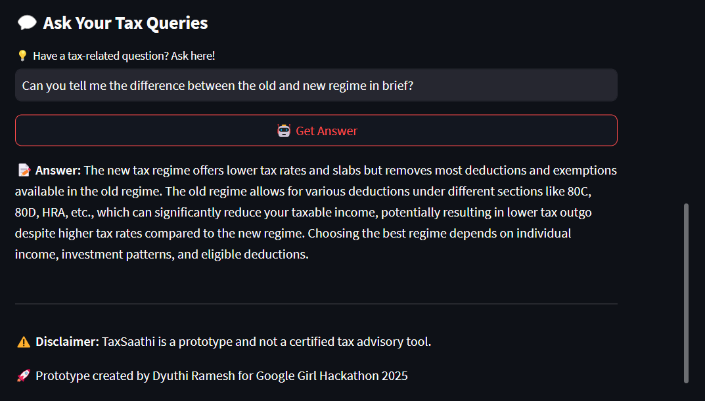
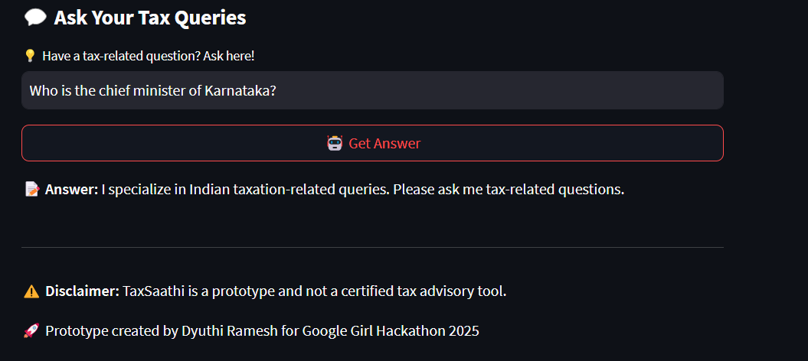
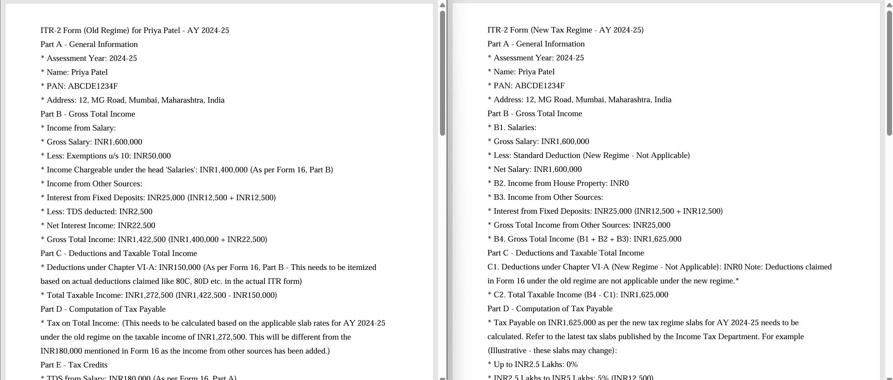
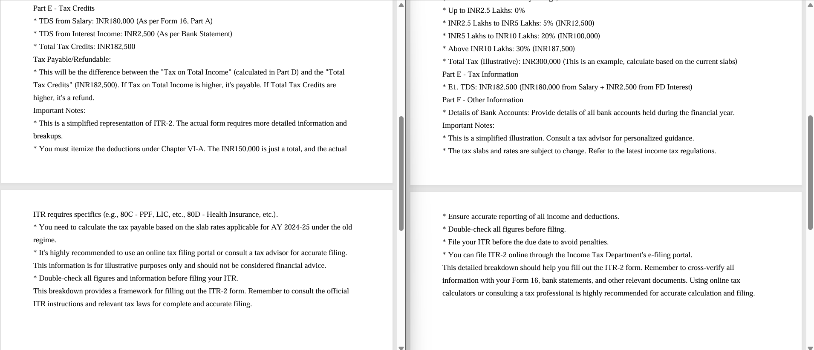

# 🧾 **TaxSaathi: Taxes Made Less Taxing**

## 🚀 **Overview**

**TaxSaathi** is an AI-driven tax assistant designed to automate the tax filing process in India. The solution simplifies tax filing by analyzing financial documents, computing tax liabilities, and generating ready-to-file ITR-2 forms under both old and new tax regimes. Additionally, TaxSaathi offers an interactive AI assistant to answer tax-related queries using a RAG (Retrieval-Augmented Generation) pipeline.



## 💡 **Key Features**

- 📂 **Document Upload & Analysis:** Extracts relevant data from Form 16, investment proofs, and bank statements.
- ⚖️ **Tax Regime Comparison:** Computes tax liabilities under both old and new regimes and recommends the optimal choice.
- 💬 **AI-Driven Query Handling:** Answers tax-related queries using a Retrieval-Augmented Generation (RAG) approach.
- 📥 **ITR-2 Form Generation:** Creates ready-to-file ITR-2 forms with a focus on compliance with Indian tax regulations.

---

## 🛠️ **Technologies Used**

- **Frontend:** Streamlit for an interactive web interface.
- **Document Processing:** PyPDF2 for extracting structured data from PDFs.
- **Tax Calculation:** Gemini API with structured prompts for accurate tax computation.
- **RAG Pipeline:** Langchain, ChromaDB, and HuggingFaceEmbeddings for intelligent query responses.
- **Data Handling:** Pandas for data manipulation, SQLite/JSON for secure data storage.

---

## 🎯 **Solution Approach**

### 1. **Document Processing:**

- Extracts financial data using PyPDF2.
- Parses income, deductions, and investment details from uploaded PDFs.

### 2. **Tax Calculation:**

- Uses AI to compute tax liabilities under both old and new regimes.
- Suggests the optimal regime for maximum savings.

### 3. **RAG Query Handling:**

- Combines Langchain, ChromaDB, and AI models to provide contextual answers to tax queries.

### 4. **ITR-2 Generation:**

- Produces ready-to-file ITR-2 forms under both tax regimes.

### 5. **UI/UX Design:**

- Provides an easy-to-navigate interface for uploading documents, viewing tax insights, and interacting with the AI assistant.

---

## 📂 **Project Structure**

```plaintext
TaxSaathi/
├── assets/                     # Images and logos
├── chroma_db                   # ChromaDB vector store for RAG pipeline
├── modules/                    # Core application modules
│   ├── document_processing.py  # Handles PDF data extraction
│   ├── tax_calculation.py      # Computes tax liabilities and generates ITR-2
│   ├── rag_pipeline.py         # RAG model for AI query handling
│   └── utils.py                # Helper functions and data loading
├── app.py                      # Streamlit app entry point
├── sample_input/               # Sample input files for testing
├── sample_output/              # Sample output files for reference
├── requirements.txt            # Python dependencies
├── README.md                   # Project documentation
└── LICENSE                     # License information
```

---

## ⚙️ **Installation & Setup**

### 1. **Clone the Repository:**

```bash
git clone https://github.com/dyuthiramesh/TaxSaathi.git
cd TaxSaathi
```

### 2. **Set Up the Environment:**

```bash
python3 -m venv venv
source venv/bin/activate    # On Windows: venv\Scripts\activate
```

### 3. **Install Required Packages:**

```bash
pip install -r requirements.txt
```

### 4. **Configure API Key:**

- Obtain a **GEMINI_API_KEY** from the [Gemini API Portal](https://aistudio.google.com/app/apikey).
- Create a `.env` file in the project root with the following content:

```plaintext
GEMINI_API_KEY=your_api_key_here
```

### 5. **Run the Application:**

```bash
streamlit run app.py
```

---

## 🧪 **Testing & Usage**

### 📝 **Document Upload:**

- Upload Form 16 (required) and optional investment proofs and bank statements.

### ⚖️ **Tax Regime Calculation:**

- Calculates the tax under both old and new regimes and gets the recommended choice.

### 📥 **Download ITR Forms:**

- Generate and download **ITR-2** forms for both tax regimes.

### 💬 **Ask Tax Queries:**

- Type in your tax-related questions and get AI-driven responses.

---

## 📊 **User Interface and Output Screenshots**

### **Landing page UI**



### **Document Upload Interface**



### **Tax Summary & Regime Comparison**



### **AI Query Assistant**





### **Generated ITR-2 Form Preview**





---

## 🛡️ **Security & Compliance**

- **Data Privacy:** All processing is local; no external servers are used.
- **Regulatory Compliance:** Adheres to India's IT Act and global data privacy standards.

---

## 📜 **License**

This project is licensed under the [MIT License](LICENSE).

---

## 📝 **Disclaimer**

TaxSaathi is a prototype and not a certified tax advisory tool.

---
